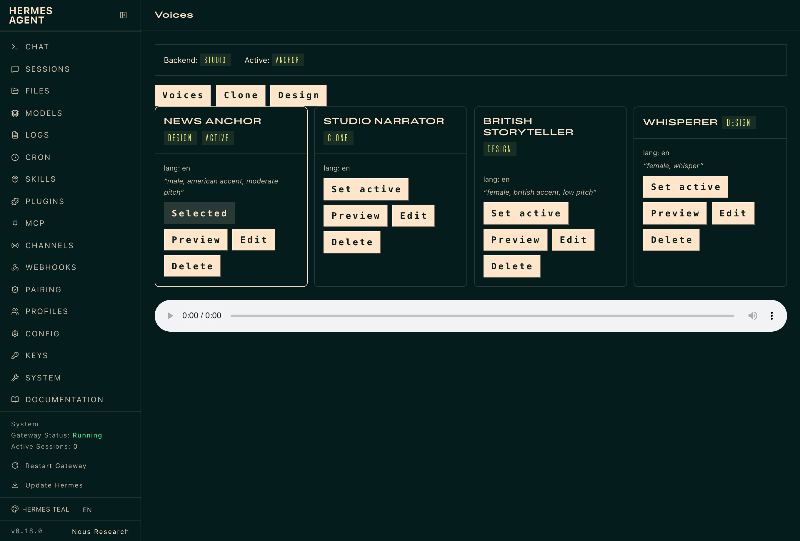
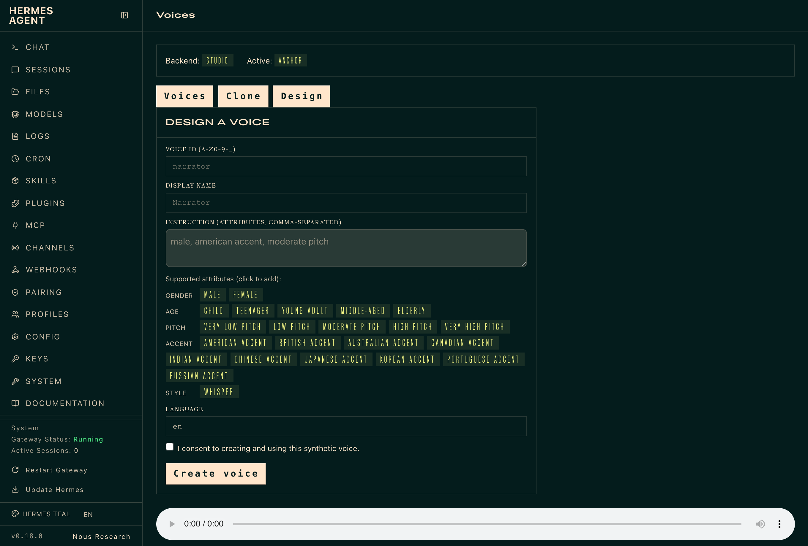
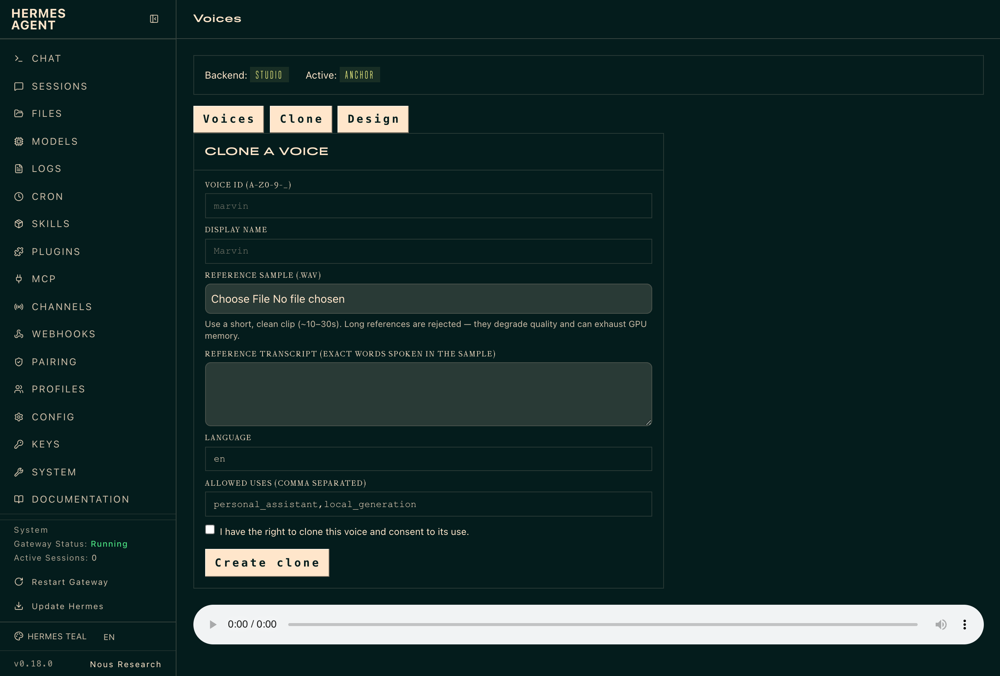

# 🎙️ OmniVoice for Hermes

Self-hosted, ElevenLabs-tier voice for your [Hermes](https://github.com/NousResearch/hermes-agent)
agent. Clone a voice from a short sample, design one from a text prompt, preview
it, and pick the active voice — all from the Hermes dashboard. No per-token cost,
no rate limits, and your reference audio never leaves your machine.



Selecting `tts.provider: omnivoice` routes **every** `text_to_speech` tool call,
voice-mode reply, Discord VC utterance, and messaging voice delivery through
OmniVoice automatically — no per-surface wiring.

> **The plugin is [`omnivoice/`](omnivoice/).** [`legacy/`](legacy/) is the
> archived first-attempt bridge, kept for provenance.

---

## ✨ What you get

| | Feature |
|---|---|
| 🎚️ | **Native TTS provider** — one config line routes all of Hermes' voice output through OmniVoice. |
| 🎨 | **Voice authoring UI** — the gap Hermes doesn't fill: a dashboard tab to clone, design, preview, and select voices. |
| 🧬 | **Clone voices** from a reference `.wav` + transcript. |
| 🗣️ | **Design voices** from a plain-text description (`male, american accent, moderate pitch`). |
| ✅ | **Consent gate + path hardening** on every clone (confirmed consent, WAV validation, symlink rejection, `0600` writes). |
| 🔌 | **Three backends** — `local` (in-process SDK), `studio` (loopback HTTP), `service` (a shared voice node over the LAN/tailnet, with bearer auth + an SSH-loopback option). |
| 🔒 | **Loopback-clean, non-loopback-gated** security, and works on hardened Hermes builds (the UI sends the dashboard session token). |

---

## 📋 Requirements

- **Hermes Agent v0.18+** (developed and tested on v0.18.0).
- A backend of your choice:
  - **`local`** (runs the model on this machine): Python 3.11, and
    `pip install omnivoice torch soundfile`. Uses CUDA / Apple-Silicon **MPS** /
    CPU automatically. First run downloads the `k2-fsa/OmniVoice` model.
  - **`studio` / `service`** (talk to an OmniVoice-Studio server over HTTP/SSH):
    nothing beyond the Python stdlib on the Hermes side.
- **`ffmpeg`** (optional) — only for non-WAV output formats. Without it, audio is
  delivered as WAV and Hermes converts for voice bubbles downstream.

---

## 🚀 Install

**1. Copy the plugin into your Hermes plugins directory.** The top-level location
is required — it's how the dashboard discovers the Voices tab.

```bash
cp -r omnivoice ~/.hermes/plugins/omnivoice
```

**2. Enable it.**

```bash
hermes plugins enable omnivoice
```

**3. Wire a model backend (setup wizard).** OmniVoice's model runtime is a real
dependency — it runs either **in-process** (`local`) or as a **speech server**
you run (`studio`/`service`). The wizard detects your environment and writes only
the `tts.omnivoice` block of your config:

```bash
python setup-omnivoice.py
```

It offers three paths — **use** a detected local setup, **install** a local
server, or point at a **remote** one. (You can also configure by hand from
[`omnivoice/config.example.yaml`](omnivoice/config.example.yaml).) The
recommended setup is a **speech server** — see
[Run the model server](#️-run-the-model-server) below.

**4. Restart Hermes.** `omnivoice` now appears in the `hermes tools` picker.
Set `tts.provider: omnivoice` when you want it to be the active voice.

> **Quick check:** run `hermes tools` and confirm **OmniVoice** shows under
> Text-to-Speech. If the plugin failed to load, check `~/.hermes/logs/errors.log`.

---

## 🖥️ Run the model server

OmniVoice's SDK ships a demo + inference CLIs but **no HTTP server**, so the
plugin includes a small one — [`server/serve.py`](server/serve.py): an
OpenAI-compatible `/v1/audio/speech` endpoint that resolves voice ids against
your registry and synthesizes. It's the **same artifact** for a single host and a
shared node, and it warms the model at startup so the first request is reliable:

```bash
pip install -r server/requirements.txt        # omnivoice torch soundfile fastapi uvicorn
# single host (loopback → backend: studio):
python server/serve.py --host 127.0.0.1 --port 8880
# shared node for a fleet of thin agents (→ backend: service):
python server/serve.py --host 0.0.0.0 --port 8880 --require-auth   # + HERMES_OMNIVOICE_SERVICE_TOKEN
```

Confirm a voice produces **intelligible speech** (a valid WAV isn't enough):

```bash
python tools/qc.py --voice <id> --server http://127.0.0.1:8880   # synth → transcribe → match score
```

---

## 🎨 Create and use voices

### From the dashboard (recommended)

Run `hermes dashboard` and open the **Voices** tab (in the sidebar).

**Design a voice** from a text description — pick the *Design* tab, give it an id
and name, and describe the voice using OmniVoice's attributes:



> **Instruction vocabulary** — OmniVoice `instruct` takes comma-separated
> attributes, not free prose. Mix and match: **gender** (`male`, `female`),
> **age** (`child`, `teenager`, `young adult`, `middle-aged`, `elderly`),
> **pitch** (`very low` → `very high`), **accent** (`american`, `british`,
> `indian`, `australian`, …), and **style** (`whisper`). Example:
> `female, british accent, low pitch`.

**Clone a voice** from a reference sample — pick the *Clone* tab, upload a
**short, clean `.wav` (~10–30 s)**, paste the exact transcript of what's said in
it, confirm consent, and create. (Very long references are rejected — they
degrade quality and can exhaust GPU memory; override with
`HERMES_OMNIVOICE_MAX_REF_SECONDS`.)



**Preview** any voice card to hear a sample, **Edit** to change its name,
language, and attributes (design) or transcript (clone), and **Set active** to
make it the voice your agent speaks with. The active voice is used by every
voice surface in Hermes. Clone reference audio and transcripts never leave your
machine.

> The Design/Edit forms show a **clickable guide** of the supported attributes
> and **validate** before saving, so a voice can't be created with an unsupported
> word (like `energetic`) that would fail at synthesis.

> Cloning from a local reference sample is a **`local`-backend** capability. The
> `studio`/`service` backends select a voice the server already holds, by id.

### From the CLI / filesystem

Voices live at `~/.hermes/voices/omnivoice/<id>/voice.yaml`, and the active voice
is recorded in `~/.hermes/voices/omnivoice/.active`. The `hermes tools` picker and
the dashboard read and write the **same** registry, so they always agree.

---

## 🔌 Backends & deployment modes

| Backend | Runs where | Use it for |
|---|---|---|
| **`local`** | In-process on the Hermes host | A single workstation with a GPU or Apple Silicon. |
| **`studio`** | OmniVoice-Studio over **loopback** HTTP (`/v1/audio/speech`) | A model server on the same host. |
| **`service`** | A shared voice node over the **LAN/tailnet** (bearer auth) | One capable node (e.g. a Mac Studio) serving a fleet of thin agents. Supports `transport: http` or `transport: ssh-loopback`. |

Full backend config, the wire contract, streaming/fallback notes, and the
security model are in [`omnivoice/README.md`](omnivoice/README.md).

---

## 🔒 Security

Loopback is clean; non-loopback requires deliberate gating.

- The dashboard binds `127.0.0.1` by default. Every mutating/compute plugin route
  (clone, design, preview, set-active, delete) refuses non-loopback callers
  unless you set `HERMES_OMNIVOICE_ALLOW_REMOTE_CLONE=1` on a trusted network.
- The `service` backend requires a bearer token on any non-loopback URL — prefer
  a VPN/tailnet.
- Clone ingestion enforces consent (confirmed status, non-empty source, ≥1
  allowed use), validates the reference is a real WAV, rejects symlinks, and
  writes registry files `0600`.

---

## ✅ Status

- **43 offline tests pass** (`cd omnivoice && pytest -q`) — no SDK/torch/Hermes
  needed for the suite.
- **Live-tested on Hermes v0.18.0**: provider registers through the real loader
  and shows in `hermes tools`; the dashboard Voices tab + backend routes are
  discovered; the tab renders and Preview plays in a real browser (the
  screenshots above are from that run).
- **Real `local` synthesis verified** against `omnivoice 0.1.5` + torch on Apple
  Silicon (MPS): a design voice → 24 kHz WAV in ~9 s.
- `stream()` (time-to-first-audio) and cross-provider fallback are deferred by
  design; the live networked `service` path is unit-tested but not yet run
  against a production node.

---

## 📚 More

- [`omnivoice/README.md`](omnivoice/README.md) — full plugin reference (backends,
  wire contract, security, verified SDK contracts).
- [`HANDOFF.md`](HANDOFF.md) — what changed, what was verified live, and why.
- [`legacy/`](legacy/) — the archived first-attempt bridge and the components
  worth harvesting later.
