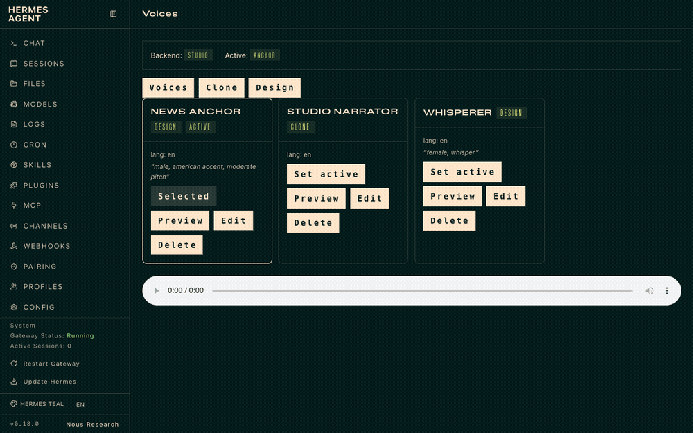
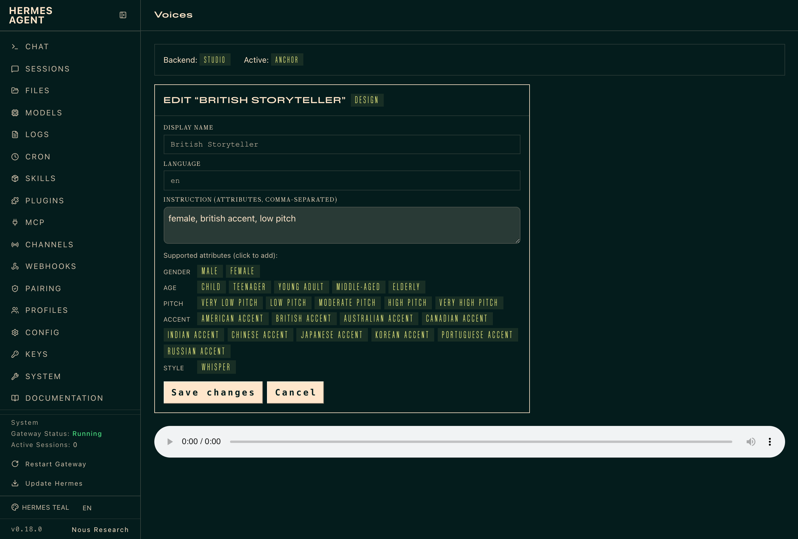
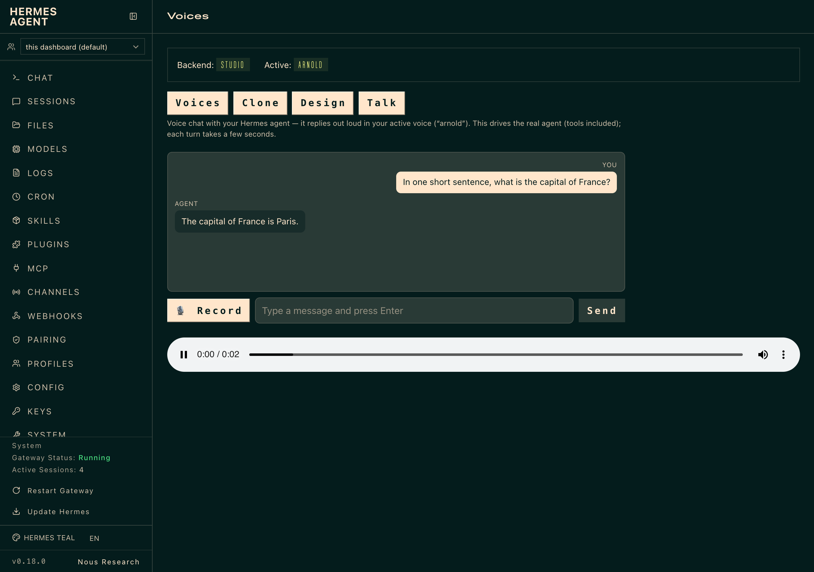

# 🎙️ OmniVoice for Hermes

**Self-hosted, ElevenLabs-tier voice for your [Hermes](https://github.com/NousResearch/hermes-agent) agent.**
Clone a voice from a short sample, design one from a text prompt, preview it, and
pick the active voice — all from the Hermes dashboard. No per-token cost, no rate
limits, and your reference audio never leaves your machine.



Selecting `tts.provider: omnivoice` routes **every** `text_to_speech` tool call,
voice-mode reply, Discord VC utterance, and messaging voice delivery through
OmniVoice automatically — no per-surface wiring.

> **The plugin is [`omnivoice/`](omnivoice/)** and installs via the normal Hermes
> route. [`legacy/`](legacy/) is the archived first-attempt bridge, kept for
> provenance.

---

## ✨ Highlights

| | |
|---|---|
| 🎚️ **One provider** | `tts.provider: omnivoice` routes all of Hermes' voice output through OmniVoice. |
| 🎨 **Voice authoring UI** | A dashboard **Voices** tab to clone, design, preview, edit, and select voices — the gap Hermes doesn't fill. |
| 🗣️ **Talk to your agent** | A **Talk** tab: speak (or type), the real Hermes agent answers, and the reply plays back out loud in your active voice. |
| 🧬 **Clone** | From a short reference `.wav` + transcript. |
| 🗣️ **Design** | From attributes (`male, american accent, moderate pitch`), with a **clickable guide + validation**. |
| ✂️ **Edit** | Change a voice's name, language, attributes, or transcript after the fact. |
| ✅ **Consent + hardening** | Confirmed consent, WAV validation, symlink rejection, `0600` writes, reference-length cap. |
| 🔌 **Three backends** | `local` (in-process), `studio` (loopback server), `service` (LAN/tailnet node, bearer auth, ssh-loopback). |
| 🖥️ **Model server included** | A small OpenAI-compatible `/v1/audio/speech` server — the same artifact from one host to a shared fleet. |

---

## 📦 Install

### 1. Install the plugin (normal Hermes route)

```bash
hermes plugins install MahdiHedhli/hermes-omnivoice/omnivoice
hermes gateway restart
```

That's it — the plugin is installed to `~/.hermes/plugins/omnivoice/` and enabled.
Confirm with `hermes plugins list` (look for `omnivoice … enabled`) and `hermes
tools` (an **OmniVoice** row under Text-to-Speech).

### 2. Give it a model backend

OmniVoice's model runtime is a real dependency — it runs either **in-process**
(`local`) or as a **speech server** you run (`studio`/`service`). Pick one and add
the matching block under `tts:` in `~/.hermes/config.yaml`
(see [`omnivoice/config.example.yaml`](omnivoice/config.example.yaml)):

**A. Local server (recommended)** — keeps Hermes light; one artifact scales to a fleet:

```bash
git clone https://github.com/MahdiHedhli/hermes-omnivoice
cd hermes-omnivoice
pip install -r server/requirements.txt              # omnivoice torch soundfile fastapi uvicorn
python server/serve.py --host 127.0.0.1 --port 8880 # warms the model at startup
```
```yaml
tts:
  provider: omnivoice
  omnivoice:
    backend: studio
    studio: { url: http://127.0.0.1:8880 }
```

**B. In-process** — no separate server, but Hermes' own env needs the model deps:

```bash
pip install omnivoice torch soundfile   # into Hermes' Python environment
```
```yaml
tts: { provider: omnivoice, omnivoice: { backend: local, local: { device: auto } } }
```

**C. Remote node (Mode B)** — one capable machine serves many thin agents:

```yaml
tts:
  provider: omnivoice
  omnivoice:
    backend: service
    service:
      url: http://mac-studio.local:8880   # or a tailnet IP
      auth_token_env: HERMES_OMNIVOICE_SERVICE_TOKEN
      transport: http                     # or ssh-loopback
```

> **Shortcut:** from a repo clone, `python setup-omnivoice.py` detects your
> environment and writes the right block for you (use-detected / install-local /
> remote).

Then set `tts.provider: omnivoice` and restart the gateway. Requires **Hermes
Agent v0.18+** (developed on v0.18.0).

---

## 🎨 Using it

Run `hermes dashboard` and open the **Voices** tab. Each voice is a card with
Preview / Edit / Set-active / Delete.


### Design a voice from attributes

Pick *Design*, give it an id and name, and describe the voice. The form shows a
**clickable guide** of the supported attributes and **validates** before saving —
so a voice can't be created with a free word (like `energetic`) that would fail
at synthesis.


> **Attributes:** gender (`male`/`female`), age (`child`…`elderly`), pitch
> (`very low`…`very high`), accent (`american`/`british`/`indian`/…), and
> `whisper`. Comma-separated. Click a chip to add it.

### Clone a voice from a sample

Pick *Clone*, upload a **short, clean `.wav` (~10–30 s)**, paste the exact
transcript, confirm consent, and create. Reference audio and transcripts never
leave your machine.


### Preview, edit, and select

Every card has **Preview** (hear a sample), **Edit** (change name / attributes /
transcript), and **Set active** (make it the voice your agent speaks with). The
active voice is used by every voice surface in Hermes.



### From the CLI / filesystem

Voices live at `~/.hermes/voices/omnivoice/<id>/voice.yaml`; the active one is in
`~/.hermes/voices/omnivoice/.active`. The `hermes tools` picker and the dashboard
read and write the **same** registry, so they always agree.

---

## 🗣️ Talk to your agent

The **Talk** tab turns the dashboard into a hands-free voice conversation with
your Hermes agent — it answers out loud in whichever voice you've made active.



Each turn composes three native pieces, no reimplementation:

1. **You speak** (🎙️ Record) or type. Recordings go to Hermes' own
   `/api/audio/transcribe` (your configured STT — e.g. local Whisper).
2. **The agent answers.** The transcript is handed to the *real* agent via its
   stable single-query CLI (`hermes chat -q -Q --resume <session>`), so replies
   have full tool access and the conversation keeps context across turns.
3. **The reply is spoken** through the plugin's own OmniVoice synth in your
   **active voice** — so it answers in your cloned/designed voice regardless of
   `tts.provider`.

> **Good to know.** This drives your actual agent, tools included — treat a voice
> message like any agent instruction. Each turn takes a few seconds (the agent
> thinks, then the reply is synthesized). The mic needs a `127.0.0.1`/HTTPS
> dashboard (a secure context) and microphone permission. Set an **active voice**
> first, or replies come back as text only.

---

## 🔌 Backends & deployment

| Backend | Runs where | Use it for |
|---|---|---|
| `local` | In-process on the Hermes host | A single workstation with a GPU or Apple Silicon. |
| `studio` | A loopback speech server (`/v1/audio/speech`) | A model server on the same host. |
| `service` | A shared node over LAN/tailnet (bearer auth; `http` or `ssh-loopback`) | One capable node serving a fleet of thin agents. |

### The model server

OmniVoice's SDK ships a demo + inference CLIs but **no HTTP server**, so the repo
includes one — [`server/serve.py`](server/serve.py). It resolves voice ids
against your registry, **warms the model at startup**, defaults to `float16`, and
**frees GPU/MPS memory after every synth** (so long sessions don't OOM). Serve a
fleet by binding a LAN address + a token:

```bash
export HERMES_OMNIVOICE_SERVICE_TOKEN=$(openssl rand -hex 24)
python server/serve.py --host 0.0.0.0 --port 8880 --require-auth
```

See [`server/README.md`](server/README.md) for all options.

---

## 🧪 Verify it actually speaks

A valid WAV is not the same as intelligible speech. Check any voice with ASR:

```bash
python tools/qc.py --voice <id> --server http://127.0.0.1:8880   # synth → transcribe → match score
```

---

## 🔒 Security

Loopback is clean; non-loopback needs deliberate gating.

- The dashboard binds `127.0.0.1`. Every mutating/compute plugin route (clone,
  design, edit, preview, set-active, delete) refuses non-loopback callers unless
  `HERMES_OMNIVOICE_ALLOW_REMOTE_CLONE=1`.
- The `service` backend requires a bearer token on any non-loopback URL — prefer
  a VPN/tailnet.
- Clone ingestion enforces consent (confirmed status, non-empty source, ≥1
  allowed use), validates a real WAV, rejects symlinks, caps reference length,
  and writes registry files `0600`.

---

## 🩺 Troubleshooting

| Symptom | Fix |
|---|---|
| **"Unauthorized"** in the Voices tab | Old dashboard build; update Hermes (the UI sends the session token, which hardened builds require). |
| Preview shows **"unsupported instruct attribute"** | Your design voice uses a word outside the vocabulary (e.g. `energetic`). **Edit** it and use only the listed attributes. |
| Preview shows **"…out of memory"** | A too-long clone reference. Re-clone with a **~10–30 s** clip (long refs are rejected; override with `HERMES_OMNIVOICE_MAX_REF_SECONDS`). |
| Preview shows **"SDK not installed"** / **server unreachable** | No model backend running. Start `server/serve.py` (studio/service) or `pip install omnivoice torch soundfile` (local). |
| Static / garbage audio | Almost always an MPS OOM from a long reference — restart the server and use short refs. Confirm with `tools/qc.py`. |
| Edited a voice / changed backend but the dashboard didn't notice | Backend route changes mount at startup — restart `hermes dashboard`. |

---

## ✅ Status

- **57 offline tests pass** (`cd omnivoice && pytest -q`).
- **Live-tested on Hermes v0.18.0**: installs via `hermes plugins install`, shows
  in `hermes tools`, the Voices tab renders and previews play; real synthesis
  ASR-verified across cpu/mps; 10 back-to-back synths, 0 OOM after the memory fix.
  The **Talk** tab was verified end-to-end in-browser: transcript renders, the
  agent replies (with `--resume` continuity), and the reply plays in the active
  voice.
- Deferred by design: streaming `stream()` and cross-provider fallback.

---

## 📚 More

- [`omnivoice/README.md`](omnivoice/README.md) — plugin reference (backends, wire contract, verified SDK contracts).
- [`server/README.md`](server/README.md) — the model server.
- [`setup-omnivoice.py`](setup-omnivoice.py) — the setup wizard · [`tools/qc.py`](tools/qc.py) — ASR quality check.
- [`HANDOFF.md`](HANDOFF.md) — how this was built and verified · [`legacy/`](legacy/) — the archived first attempt.
